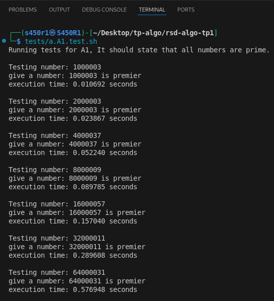
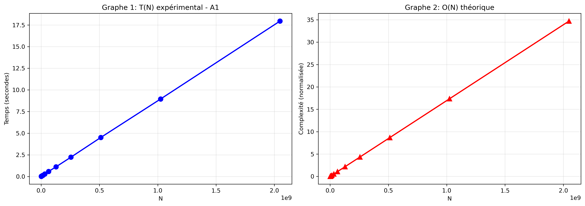
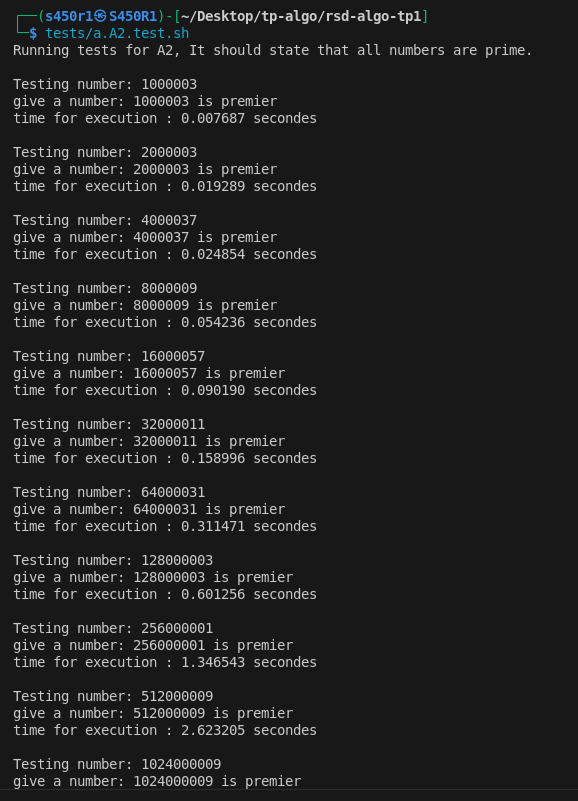
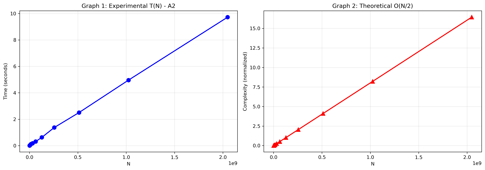
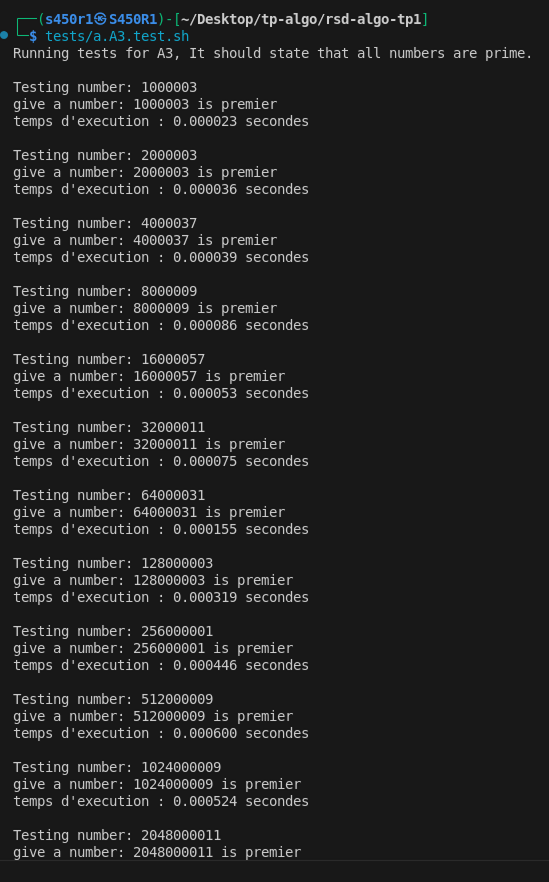
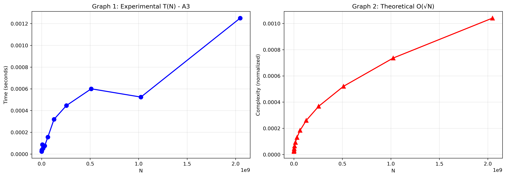
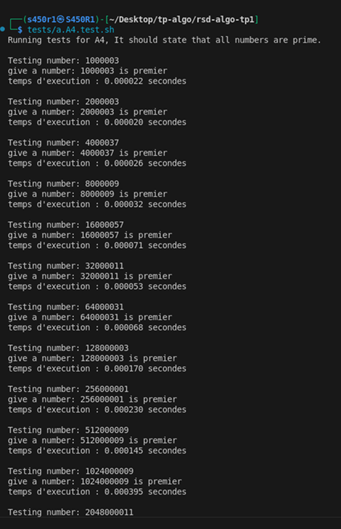
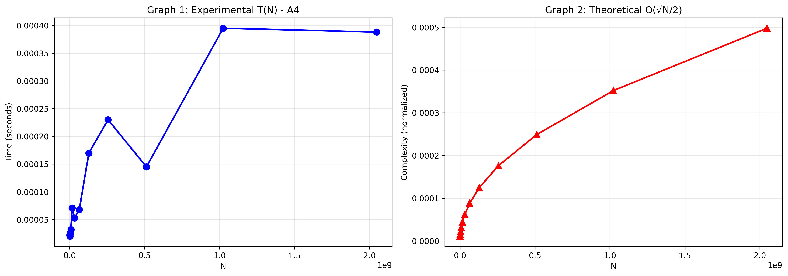

# Introduction


This repository was done as part of the practical activities we are doing in Distributed Algorithms and Complexity for speciality of Distributed Networks. Faculty of Computer Science, University of Sciences and Technology of Houari Boumedienne under the supervision of Dr. Imane Messaoudi.


This was done by:

- Ilyes Medjedoub (S450R1).

- Rawa Tesnim El Jenna Beddiar

- Bouzouad Rayane Fouzi.

- Okba Moulahoum.

You can find the instructions given by our teacher in `static/instructions.pdf`. The main subject is `Primality test`. The goal from this practical activity is to test different methods for the same problem taking execution time in consideration.

We are testing if an integer number is prime. 04 algorithms were proposed and should be implemented in `C` language.

# Remember

An integer `n` is prime if it have only two divisers, the number itself `n` and `1`.

# First Algorithm (A1): Naive Approach

1 - In this solution, we implemented a loop that will test if the integer `n` can be divised by `2`, `3`, `...`, `n-1`.

```c
p = 1; 
for (i = 2; i < N; i++) {
    if (N % i == 0) {
        p = 0;
        break;
    }
}
```

2 - The theorical complexity in worst case for this algorithm is O(N) and this happen when `N` is prime.

3 - We have written this program in `A1.c`. Let's test it together.

a - We need to test this array of integers `test_numbers`.

```c
int test_numbers[] = {
    1000003,
    2000003,
    4000037,
    8000009,
    16000057,
    32000011,
    64000031,
    128000003,
    256000001,
    512000009,
    1024000009,
    2048000011
};
```

If the code works it will state that all these integers are prime.

b - Let's mesure the time of execution for every number. To do this we used the `clock()` function from `<time.h>`. See code at `A1.c`. 

Let's compile our program using this shell command:

```sh
gcc -o A1 A1.c
```

Then we can do the test using this shell script that can be found in `tests/a.A1.test.sh`. Make sure to make it executable using this command:

```sh
chmod +x tests/a.A1.test.sh
```

Then run it using:

```sh
tests/a.A1.test.sh
```

We got this output:



c - From the above test, we notice that the time of execution gets bigger in the same time that the integer `N` gets bigger.

d - After these results and the above thing we noticed. Yes, the theorical predictions we made `O(N)` are compatible with the experimental mesures.

e - In two graphs, we represented the variations of execution time `T(N)` and complexity in worst case `O(N)`. Since we're on Kali we used a python script to generate the graph (See `graphs/A1.graph.py`).

```sh
python3 graphs/A1.graph.py
```

Here is the generated graph found at `static/A1.graph.png`



# Second Algorithm (A2): Improving the Naive Approach

1 - We already know that for every divisor `i` of number `N`: `is` will be smaller or equals `N/2` expect for `i=N`. We used that to create the second algorithm (See `A2.c`).

```c
p = 1;
for (i = 2; i <= N / 2; i++) {
    if (N % i == 0) {
        p = 0;
        break;
    }
}
```

2 - Worst-case complexity: `O(N)`. When `N` is prime, the loop performs (`N/2 - 1`) iterations. `T(N)` = `(c/2)N + k = Θ(N)`. Compared to `A1` it halves the constant factor but keeps linear growth.

3 - We have written this program in `A2.c`. Let's test it together. We will use the same array of numbers used for testing `A1`.

Let's compile our program using this shell command:

```sh
gcc -o A2 A2.c
```

Then we can do the test using this shell script that can be found in `tests/a.A2.test.sh`. Make sure to make it executable using this command:

```sh
chmod +x tests/a.A2.test.sh
```

Then run it using:

```sh
tests/a.A2.test.sh
```

We got this output:



In two graphs, we represented the variations of execution time `T(N)` and complexity in worst case `O(N)`. Since we're on Kali we used a python script to generate the graph (See `graphs/A2.graph.py`).

```sh
python3 graphs/A2.graph.py
```

Here is the generated graph found at `static/A2.graph.png`



After comparing algorithm `A1`, and algorithm `A2`. They are both linear but `A2` is two times better then `A1`.

# Third Algorithm (A3):

1 - The divisors of an integer `N` are such that half of them are smaller than or equal to `√N`, and the other half are greater than or equal to `√N`. so we can use this logic:

```c
p = 1;
for (i = 2; i <= sqrt(N); i++) {
    if (N % i == 0) {
        p = 0;
        break;
    }
}
```
2 - Worst-case complexity: `O(√N)`. When `N` is prime (or its smallest divisor is > `√N`), the loop runs from `i = 2` to ⌊`√N`⌋, giving `Θ(√N)` iterations. Therefore T(N) = `c√N + k = Θ(√N)`.

3 - We have written this program in `A3.c`. Let's test it together. We will use the same array of numbers used for testing `A1`.

Let's compile our program using this shell command:

```sh
gcc -o A3 A3.c -lm
```

Then we can do the test using this shell script that can be found in `tests/a.A3.test.sh`. Make sure to make it executable using this command:

```sh
chmod +x tests/a.A3.test.sh
```

Then run it using:

```sh
tests/a.A3.test.sh
```

We got this output:



In two graphs, we represented the variations of execution time `T(N)` and complexity in worst case `O(N)`. Since we're on Kali we used a python script to generate the graph (See `graphs/A3.graph.py`).

```sh
python3 graphs/A3.graph.py
```

Here is the generated graph found at `static/A3.graph.png`



After comparing algorithm `A1`, algorithm `A2` and algorithm `A3`. 

- `A1`: `O(N)`, slowest.
- `A2`: `O(N)`, ~2× faster than `A1` (better constant).
- `A3`: `O(√N)`, fastest and scales best.

# Fourth Algorithm (A4):

1 - Another possible improvement of the algorithm is to check if `N` is an odd number. In this case we will test the divisibility of `N` only by odd numbers in the loop.

```c
if (N == 2) {
    printf("2 est premier\n");
    return 0;
}
if (N < 2 || N % 2 == 0) {
    printf("%ld isn't premier\n", N);
    return 0;
}

p = 1;
for (i = 3; i <= sqrt(N); i += 2) {
    if (N % i == 0) {
        p = 0;
        break;
    }
}
```

2 - Worst-case complexity: `O(√N)`. The constant-time prechecks handle `N ≤ 3` and even `N`. For odd `N`, the loop tests only odd divisors `i = 3, 5, …, ⌊√N⌋`, giving about `(⌊√N⌋ − 1)/2` iterations. So T(N) = `(c/2)√N + k = Θ(√N)`. 

Worst case occurs when `N` is an odd prime (or has no odd divisor ≤ `√N`). This halves the constant vs `A3`.

3 - We have written this program in `A4.c`. Let's test it together. We will use the same array of numbers used for testing `A1`.

Let's compile our program using this shell command:

```sh
gcc -o A4 A4.c -lm
```

Then we can do the test using this shell script that can be found in `tests/a.A4.test.sh`. Make sure to make it executable using this command:

```sh
chmod +x tests/a.A4.test.sh
```

Then run it using:

```sh
tests/a.A4.test.sh
```

We got this output:



In two graphs, we represented the variations of execution time `T(N)` and complexity in worst case `O(N)`. Since we're on Kali we used a python script to generate the graph (See `graphs/A4.graph.py`).

```sh
python3 graphs/A4.graph.py
```

Here is the generated graph found at `static/A4.graph.png`



After comparing algorithm `A1`, algorithm `A2`, algorith `A3` and algorithm `A4`. 

- `A1`: `O(N)`, slowest.
- `A2`: `O(N)`, ~2× faster than `A1` (better constant).
- `A3`: `O(√N)`, faster then `A1` and `A2`.
- `A4`: `O(√N)`, ~2× faster than `A3` (better constant).


